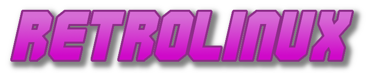

<div align="center">

<p align="center" style="vertical-align: middle">
  
  
  
</p>

**Contributing to RetroWallpapers** — add a pack, fix metadata, or improve the CLI.

Arch. Retro. Neon. Pull your collection into the desktop with one command.

</div>

---

## 📖 How it works

Each collection lives on its own **orphan branch** — a clean, history-free branch holding only that pack's wallpapers. `main` holds this README, `metadata.json`, `descriptions.json`, the logos, and the `retrowal` CLI.

The [`retrowal`](retrowal) CLI handles the whole lifecycle: pull, create, build, and publish. Everything below assumes you run it from the repo root.

> **First command you need to run is `./retrowal pull`.** `build` and `publish` refuse to run until every remote collection branch exists locally.

---

## ✅ Prerequisites

- **bash** (the CLI is a bash script)
- **git**
- **jq** (used to read/write `metadata.json` and `descriptions.json`)

---

## 🖥️ CLI reference

| Command | Description |
|---------|-------------|
| `./retrowal pull` | Fetch `origin` and create a local branch for every collection |
| `./retrowal create <name> [dir]` | Create a new collection from a folder of wallpapers |
| `./retrowal build` | Recompute `metadata.json` + refresh the README collection table |
| `./retrowal publish [--yes]` | Push all collection branches + `main` to GitHub |
| `./retrowal list` | List the collections in this repo |
| `./retrowal --help` | Show help |

Run `./retrowal --help` for up-to-date usage and examples.

---

## 🧭 Before you start

Clone the repo and pull every collection branch locally:

```bash
git clone https://github.com/itsvlxd/retrowallpapers.git
cd retrowallpapers
./retrowal pull
```

This creates a local branch for each remote collection (e.g. `noir`, `retro`, `sunset`), so you can inspect and modify them.

---

## ➕ Adding a new collection

Say you have a folder of wallpapers at `/path/to/wallpapers` and want to call the pack `neon`:

```bash
# 1. Create the collection on its own orphan branch
./retrowal create neon /path/to/wallpapers

# 2. Build metadata.json + the README table
./retrowal build

# 3. Push everything to GitHub
./retrowal publish
```

Notes:

- The collection name must match `^[a-z0-9_-]+$`.
- Supported formats: `png`, `jpg`, `jpeg`, `webp`, `gif` (static) and `mp4`, `mkv`, `webm` (live). Tags are set automatically.
- `create` asks for a description. If you skip it, `publish` will prompt you again — and block if a collection has no description.

---

## ✏️ Updating an existing collection

```bash
./retrowal pull                 # make sure you have the branch
git checkout <collection>       # e.g. retro
# add/remove wallpaper files...
git add -A
git commit -m "feat: add wallpapers to <collection>"
git checkout main
./retrowal build                # refresh metadata + README
./retrowal publish              # push the branch + main
```

---

## 🚀 Publishing

`./retrowal publish` does the following checks before pushing:

1. **All remote branches are local** — otherwise it stops and tells you to run `./retrowal pull`.
2. **Every local collection is in `metadata.json`** — a new collection must be built first, so run `./retrowal build`.
3. **Every collection has a description** — it prompts `Write a description for '<name>':` for any that are missing. With `--yes` it skips the prompts and fails instead if any are missing.

```bash
./retrowal publish              # interactive
./retrowal publish --yes        # skip all prompts (CI-friendly)
```

---

## 🧹 Removing a collection

```bash
git push origin --delete mypack
```

Then remove it from `descriptions.json` and run `./retrowal build` so the README table drops it.

---

## 🎨 Styling & conventions

- Follow the existing README structure: logo header, `##` sections, and the RetroLinux ecosystem footer.
- Keep descriptions short and evocative (see `descriptions.json` for tone).
- Keep wallpaper files flat in the collection branch root — no subfolders.
- Don't commit secrets or large non-wallpaper binaries.

---

## 📜 License & attribution

This repository is licensed under **CC BY 4.0** — see [LICENSE](LICENSE). When you contribute a collection:

- Add attribution for any wallpapers sourced from third-party creators (e.g. moewalls.com). Those retain their original rights — contact the original authors before commercial redistribution.
- Your curated collection is offered under the same CC BY 4.0 terms.

---

<br><br>
---
<div align="center">
  
  
  

  <sub>© 2026 itsvlxd & Contributors • Part of the <a href="https://github.com/itsvlxd/RetroLinux">RetroLinux</a> ecosystem &nbsp;&nbsp;|&nbsp;&nbsp; <a href="https://github.com/itsvlxd/RetroLinux">🌴 RetroLinux</a> • <a href="https://github.com/itsvlxd/retrowallpapers">🖼️ Wallpapers</a> • <a href="https://github.com/itsvlxd/retrowallpapers/issues">🐛 Issues</a> • <a href="https://github.com/itsvlxd/retrowallpapers/pulls">🔧 Pulls</a></sub>
  <br>
  <sub><i>Licensed under CC BY 4.0. You are free to share and adapt the curated collections with attribution, provided completely without warranty of any kind.</i></sub>
</div>
