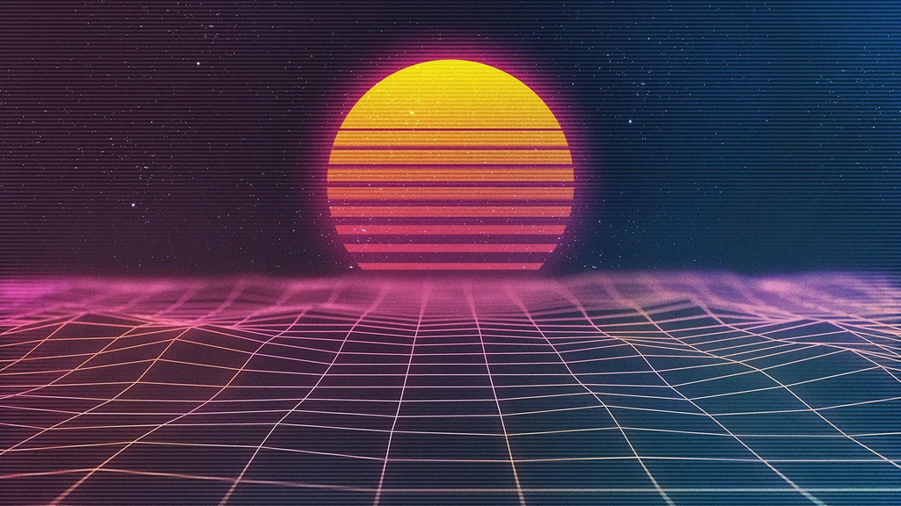

<div align="center">

<p align="center" style="vertical-align: middle">
  
  
  
</p>

**RetroWallpapers** — the wallpaper collection for [RetroLinux](https://github.com/itsvlxd/RetroLinux).

Arch. Retro. Neon. Hand-tuned packs for every mood — pulled straight into your desktop with one command.

</div>

---

## 📦 What's inside

| Collection | Branch | Wallpapers | Size | Mood |
|------------|:------:|:----------:|:----:|------|
<!-- COLLECTIONS:START -->
| **noir** | `noir` | 8 | 83.0 MB | Dark, monochrome and cinematic. Stripped of color, full of mood. |
| **retro** | `retro` | 21 | 130.3 MB | Neon-soaked synthwave, retro cars and outrun vibes. |
| **sunset** | `sunset` | 9 | 274.6 MB | Golden-hour landscapes, calm oceans and warm skies. |
<!-- COLLECTIONS:END -->

> Sizes auto-computed by GitHub Actions and stored in [`metadata.json`](metadata.json).

---

## ⬇️ Installing

### With RetroLinux

```bash
retro wallpaper pull              # list available collections
retro wallpaper pull noir         # download the noir pack
retro wallpaper pull --all        # download everything
retro wallpaper sync              # refresh installed packs to latest
```

### Manually

```bash
git clone --depth 1 --branch retro --single-branch https://github.com/itsvlxd/retrowallpapers.git
```

Each collection is an **orphan branch** — a clean, history-free branch with only its own files. Shallow-cloning the branch you want keeps the download minimal.

---

## 🖼️ Collections

### noir

<sub>Dark, monochrome and cinematic. Stripped of color, full of mood.</sub>

<p align="center">
  <kbd></kbd>
</p>

### retro

<sub>Neon-soaked synthwave, retro cars and outrun vibes.</sub>

<p align="center">
  <kbd></kbd>
</p>

### sunset

<sub>Golden-hour landscapes, calm oceans and warm skies.</sub>

<p align="center">
  <kbd></kbd>
</p>

---

## 🏗️ Adding or updating a collection

Collections live on **orphan branches**. Each branch holds only its own wallpapers; `main` holds this README, previews, and `metadata.json`.

The easiest way is the bundled CLI:

```bash
# Create a new collection from a folder of wallpapers
./retrowal create mypack /path/to/wallpapers

# Regenerate metadata.json + the README table
./retrowal build

# Push all branches to GitHub
./retrowal publish
```

It recomputes file counts, sizes and branch SHAs, then updates this README's collection table automatically. On push, a GitHub Action re-runs the same build to keep `main` in sync.

To remove a collection, delete the branch:

```bash
git push origin --delete mypack
```

---

## 📜 License

This repository is licensed under the **Creative Commons Attribution 4.0 International** ([CC BY 4.0](LICENSE)).

You are free to share and adapt the curated collections, provided you give appropriate credit. Wallpapers sourced from third-party creators (e.g. moewalls.com) retain their original rights — contact the original authors before commercial redistribution.

<br><br>
---
<div align="center">
  
  
  

  <sub>© 2026 itsvlxd & Contributors • Part of the <a href="https://github.com/itsvlxd/RetroLinux">RetroLinux</a> ecosystem &nbsp;&nbsp;|&nbsp;&nbsp; <a href="https://github.com/itsvlxd/RetroLinux">🌴 RetroLinux</a> • <a href="https://github.com/itsvlxd/retrowallpapers">🖼️ Wallpapers</a> • <a href="https://github.com/itsvlxd/retrowallpapers/issues">🐛 Issues</a> • <a href="https://github.com/itsvlxd/retrowallpapers/pulls">🔧 Pulls</a></sub>
  <br>
  <sub><i>Licensed under CC BY 4.0. You are free to share and adapt the curated collections with attribution, provided completely without warranty of any kind.</i></sub>
</div>
